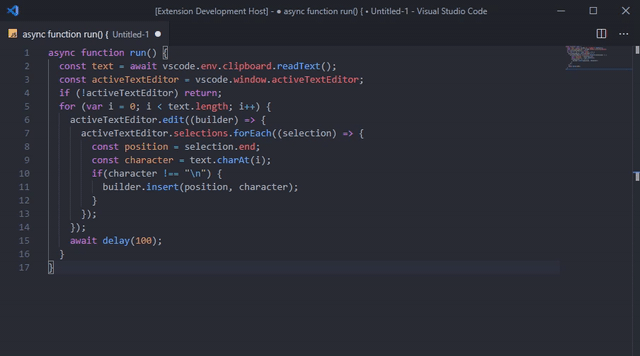

# VSCode Replay Clipboard

Pretend that you type like a pr0h4x0r in your videos by replaying whatever you have in your clipboard.

Copy any code snippet to your clipboard (<kbd>ctrl</kbd>+<kbd>C</kbd> or <kbd>ctrl</kbd>+<kbd>X</kbd>);
Put the cursor where you want it to type;
Press <kbd>ctrl</kbd>+<kbd>alt</kbd>+<kbd>r</kbd> and watch peoples reaction!

